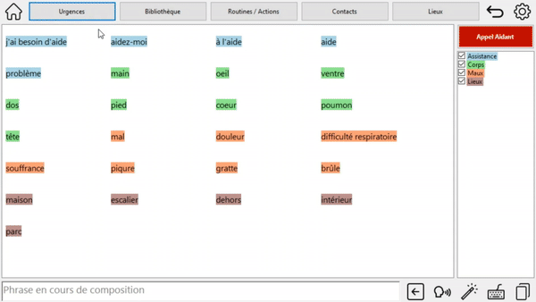
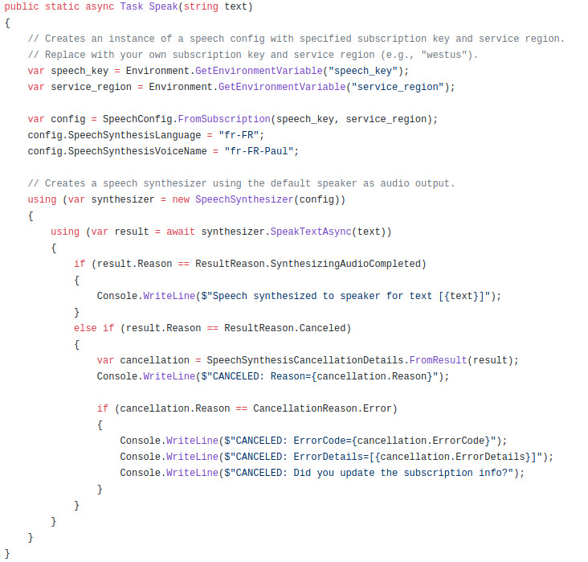
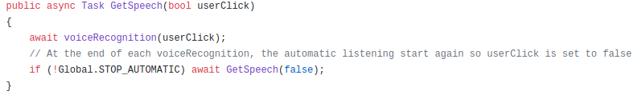

# MicrosoftALISProject
### Contexte
Le Locked-In Syndrome (LIS) est une maladie neurologique rare qui survient généralement à la suite d'un AVC.  Les personnes atteintes se retrouvent pour la plupart tétraplégiques et muettes. Pour communiquer, des solutions existent mais sont très chronophages, demandant à l’utilisateur d’écrire caractère par caractère.

Ce projet, initié par Microsoft en collaboration avec l’association ALIS, a pour objectif de faciliter la communication d’une personne LIS avec un interlocuteur physique grâce à de l’Intelligence Artificielle. Pour cela, une solution de type clavier prédictif a été imaginée. L’application réalisée vise à  détecter les phrases prononcées par l’interlocuteur et proposer différents thèmes ainsi que leurs mots associés afin de permettre à l’utilisateur de composer une phrase beaucoup plus rapidement que les solutions existantes actuellement.

Voici notre interface ergonomique pour la Communication Alternative Augmentée afin d'aider les personnes atteintes du Locked In Syndrome.

### Installation

L'application nécessite Visual Studio.
Afin de pouvoir utiliser l'application, python et plusieurs librairies sont nécessaires.
Les commandes suivantes permettent l'installation de ces librairies:
```
pip install "transformers==2.5.1"
pip install torch==1.7.1+cpu torchvision==0.8.2+cpu torchaudio===0.7.2 -f https://download.pytorch.org/whl/torch_stable.html
pip install spacy_lefff
pip install spacy
python -m spacy download fr_core_news_sm
```

Définir dans Visual Studio des variables d'environnement pour la reconnaissance et synthèse vocale. Pour cela, aller dans Projet > Propriété > Debugger. Ajouter:
- speech_key : `Clé Microsoft`
- service_region : `francecentral` (valeur utilisé dans ce cas)

### Application

Notre interface WindowsForm se lance à partir du fichier [WindowsFormsApp1.sln](WindowsFormsApp1/WindowsFormsApp1.sln).  
Une fois lancée, plusieurs page sont disponibles :


Afin que cela soit clair et structuré, chaque page est créée à l'aide d'un UserControl.

L'application inclu une partie reconnaisance vocale qui permet de détecter lorsqu'un intrelocuteur s'adresse à l'utilisateur par un mot prédéfini, en général le nom de l'utilisateur. La configuration du nom est possible en modifiant l'username dans les [configurations](WindowsFormsApp1/Config/configFile). Le but étant que, dans le futur, cela se fasse directement dans les paramètres de l'application.

La partie synthèse vocale va rendre la parole à l'utilisateur en lui permetant d'exprimer ses idées à l'oral. C'est le bouton &nbsp;   &nbsp; qui permet cela. 

Pour toute la partie prédiction, nous utilisons l'API que nous avons développé, disponible [ici](WindowsFormsApp1\API).  

### Reconnaissance et synthèse vocale

La synthèse et la reconnaissance vocale sont implémentées via le module `Microsoft.CognitiveServices.Speech`. 
* La **synthèse vocale** est définie dans les documents `Form1.cs` et `UserControlStandard.cs` par la méthode **Speak**.

    
* La **reconnaissance vocale** est définie dans `UserControlReact.cs` par la méthode **GetSpeech**.

    

  L'execution de cette méthode se fait sous deux formes:
  * Automatique - Ce type de reconnaissance est lancé dès le lancement de l'application et écoute de façon passive l'utilisateur. Si il prononce, le nom de la personne atteinte du LIS alors le système s'active.
  
  * Manuel - L'utilisateur lance la reconnaissance en cliquant sur le bouton **Ecouter**

  Lorsque la reconnaissance est activée, le système renvoie toutes les phrases dites sur l'onglet React (`UserControlReact.cs`) jusqu'à la présence d'un mot d'arrêt.

  Ces mots clés sont présent dans un fichier de [configuration](WindowsFormsApp1/Config/configFile). Le nom de la personne est représentée par la variable **USERNAME** et Les mots d'arrêts par **STOP_WORDS**.

  Pour définir des mots d'arrêts, il suffit de les écrire séparés par `/`.

  Si l'utilisateur lance la reconnaissance de façon manuelle alors la reconnaissance automatique s'arrête. Elle reprend dès qu'un mot d'arrêt est prononcé.

### Prédiction et API

Les prédictions sont basées sur le modèle français de BERT, camemBERT et sont effectuées sous l'idée d'un mask, autrement dit, d'une phrase à trous. 

Pour avoir accès à la prédiction, il faut lancer le script python API.py. Celui-ci lancera l'API de prédiction de mots sur localhost:5001/api/predictNext.
Cette prédiction prend en compte deux paramètres, prise en compte dans la fonction **nextWord(text, number_Of_Predictions):**. 

Le texte **text** est celui dont on veut prédire la suite. Un espace à la fin de la phrase en cours indiquera de prédire le prochain mot, si il n'y a pas d'espace, les lettres avant le dernier espace permettront de filtrer sur la prédiction. 
Exemple : "j' aime " va prédire le prochain mot après "j'aime". "j' aime d" va prédire le prochain mot après "j'aime" commencer par la lettre "d".

Le nombre de prédictions **number_Of_Predictions** donnera le nombre de mots prédit. Ce paramètre peut réduire la rapidité de la prédiction.

L'appel à l'API dans l'application se fait à travers la fonction **GetPredict(String sentence)** qui se trouve dans `UserControlReact.cs`
Cet appel est effectué de manière POST où on envoie la phrase en cours à l'API et celle-ci nous retourne une liste avec pour chaque élément, une liste [mot prédit, tag associé au mot prédit]. Le tag étant (sujet, verbe, ...).

Le rajout des mots obtenus de l'API dans l'application se fait à travers la fonction **finalSentence_TextChanged** disponible dans `Form1.cs`.

### Améliorations possible

- [ ] Affiner le modèle de prédiction
- [ ] Meilleur post tagger pour les thèmes
- [ ] Développement de sboutons d'édition de thèmes
- [ ] Implémentation des fonctionnalités Lieux, Bibliothèque, Contact et Paramètres
- [ ] Obtention d'une clé OpenAI pour suggérer de sréponses entières
- [ ] Construction de phrases automatiques à partir de mots clés / Système d'auto-correction
- [ ] Réécriture du modèle de prédiction en C# pour plus de rapidité


